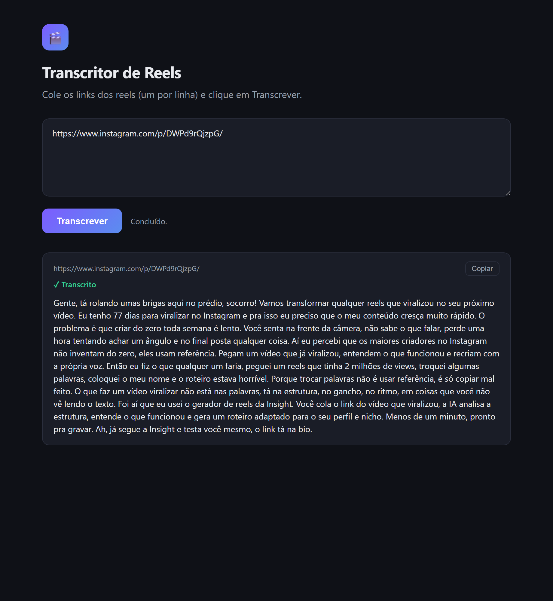

# Transcritor de Reels

Transcreva vários reels do Instagram de uma vez. Você cola os links, clica num botão e recebe o texto falado de cada vídeo — pronto para copiar.

O app roda no seu próprio computador e abre uma tela simples no navegador. Nada é instalado "na nuvem" e ninguém além de você tem acesso aos seus reels.

> **Já configuraram tudo para você?** Pule direto para a seção [**Como usar no dia a dia**](#como-usar-no-dia-a-dia). As seções de instalação só precisam ser feitas **uma vez**.



---

## O que você vai precisar

Só duas coisas, e só uma vez:

1. **Python 3** — um programa gratuito que faz o app funcionar.
2. **Uma chave da API da OpenAI** — é o que permite o app entender o áudio e transformá-lo em texto.

As duas seções a seguir explicam como conseguir cada uma, com calma.

---

## Instalação (você faz só na primeira vez)

### Passo 1 — Instalar o Python

1. Acesse **https://www.python.org/downloads/**
2. Clique no botão grande de download (ele já sugere a versão certa para o seu computador).
3. Abra o arquivo baixado e instale.
   - **No Windows:** logo na primeira tela, **marque a caixinha "Add Python to PATH"** antes de clicar em "Install Now". Isso é importante.
   - **No Mac:** é só seguir o instalador normalmente, clicando em "Continuar".

Pronto. Você não precisa abrir o Python — ele só precisa estar instalado.

### Passo 2 — Baixar o app

1. Na página do projeto no GitHub, clique no botão verde **"Code"**.
2. Escolha **"Download ZIP"**.
3. Descompacte o arquivo baixado numa pasta fácil de achar (a Área de Trabalho serve bem).

Você terá uma pasta com vários arquivos dentro — é o app.

### Passo 3 — Conseguir a sua chave da OpenAI

A chave é como uma "senha" que liga o app à OpenAI. Cada pessoa usa a sua própria.

1. Acesse **https://platform.openai.com** e crie uma conta (ou entre, se já tiver).
2. Adicione uma forma de pagamento e coloque um pouco de crédito: vá em **Settings → Billing**. Pode começar com **US$ 5** — é mais que suficiente, porque transcrever sai muito barato (veja [Quanto custa](#quanto-custa)).
3. Vá para **https://platform.openai.com/api-keys**
4. Clique em **"Create new secret key"**, dê um nome qualquer e confirme.
5. **Copie a chave na hora.** Ela aparece **uma única vez** — se fechar a janela, terá que criar outra. A chave começa com `sk-...`.

### Passo 4 — Colocar a chave no app

1. Abra a pasta do app.
2. Encontre o arquivo chamado **`.env.example`**.
3. Faça uma **cópia** desse arquivo e renomeie a cópia para **`.env`** (ou seja, tire o `.example` do nome).
4. Abra o arquivo `.env` com um editor de texto simples (Bloco de Notas no Windows, TextEdit no Mac).
5. Você verá uma linha assim:
   ```
   OPENAI_API_KEY=coloque-sua-chave-aqui
   ```
   Troque `coloque-sua-chave-aqui` pela chave que você copiou. Deve ficar assim:
   ```
   OPENAI_API_KEY=sk-suachavedeverdadeaqui
   ```
6. Salve o arquivo.

> **Dica:** o arquivo precisa se chamar exatamente `.env`, sem nada depois. Se o Bloco de Notas insistir em salvar como `.env.txt`, na hora de salvar escolha "Tipo: Todos os arquivos".

Pronto — a configuração acabou. Você nunca mais precisa repetir os passos 1 a 4.

---

## Como usar no dia a dia

### Abrir o app

- **No Windows:** dê dois cliques no arquivo **`iniciar-windows.bat`**.
- **No Mac:** dê dois cliques no arquivo **`iniciar-mac.command`**.
  - Na primeiríssima vez, o Mac pode bloquear por segurança. Se isso acontecer, clique no arquivo com o **botão direito → Abrir** e confirme. Depois disso ele abre normal.

Na **primeira vez**, o app demora alguns minutos preparando tudo — é normal, é só uma vez. Depois ele abre rápido.

Quando estiver pronto, o navegador abre sozinho na tela do app. Vai aparecer também uma janela preta (o "motor" do app) — **deixe ela aberta** enquanto estiver usando.

### Transcrever os reels

1. **Cole os links** dos reels no campo de texto — **um link por linha**.
2. Clique em **"Transcrever"**.
3. As transcrições vão aparecendo uma a uma, conforme ficam prontas.
4. Use o botão **"copiar"** de cada reel, ou **"copiar todas"** para pegar tudo de uma vez.

### Fechar o app

Quando terminar, é só **fechar a janela preta**. Para usar de novo depois, basta abrir o app outra vez (dois cliques no arquivo de iniciar).

---

## Problemas comuns

**"O Instagram pediu login" / o reel não baixa**
O Instagram às vezes exige uma conta logada para liberar o download. Para resolver:
1. No navegador, entre normalmente na sua conta do Instagram (de preferência, uma conta secundária).
2. Abra o arquivo `.env` e adicione esta linha:
   ```
   COOKIES_FROM_BROWSER=chrome
   ```
   Troque `chrome` pelo navegador que você usa: `firefox`, `safari` ou `edge`.
3. **Feche o navegador** e abra o app de novo.

**"Chave inválida" ou erro de autenticação**
Confira o arquivo `.env`: a chave deve estar completa, sem espaços sobrando, e a conta da OpenAI precisa ter crédito disponível (Passo 3).

**Dei dois cliques e nada acontece**
- No Mac: clique com o botão direito no arquivo de iniciar → **Abrir**.
- No Windows: confirme que o Python foi instalado com a caixinha **"Add Python to PATH"** marcada. Se não marcou, reinstale o Python marcando essa opção.

**Um reel deu erro mas os outros funcionaram**
Normal — cada reel é tratado separadamente. Reels de perfis privados ou só com música (sem fala) não geram texto.

---

## Quanto custa

O app em si é gratuito. Você paga apenas o uso da OpenAI, que cobra **por minuto de áudio** — e é barato: transcrever **10 reels** custa cerca de **alguns centavos de dólar**. O crédito de US$ 5 do Passo 3 dura bastante tempo.

---

## Sobre a sua chave da OpenAI

A chave é pessoal e dá acesso à sua conta. **Nunca compartilhe a chave nem envie o arquivo `.env` para ninguém.** Ele guarda a sua chave e foi configurado para nunca ser publicado junto com o projeto. Se desconfiar que sua chave vazou, vá em https://platform.openai.com/api-keys, apague a chave antiga e crie uma nova.